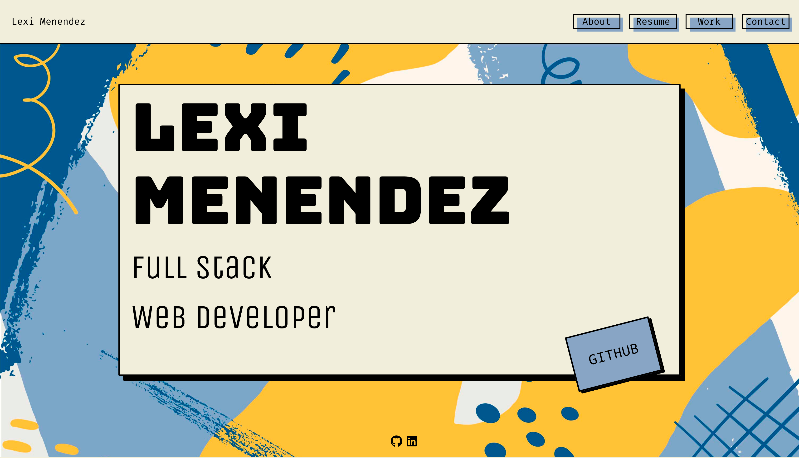
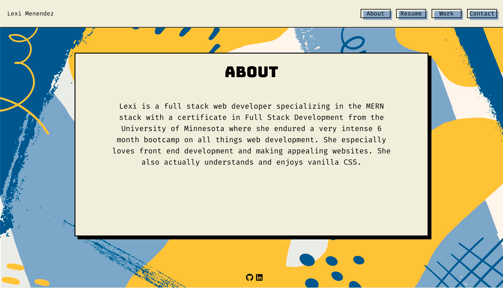
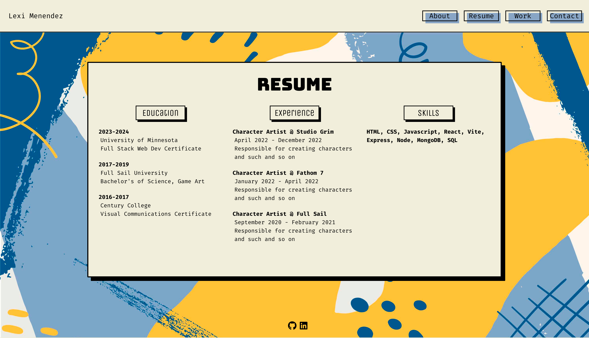
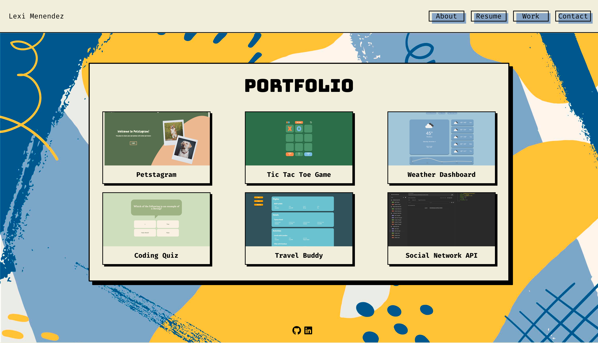
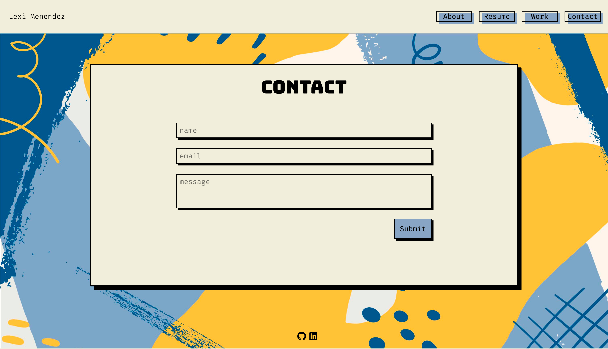

# Alexis Menendez's Portfolio

The start of my web development portfolio created using React and Vite. 

## Usage
 
 
 
 
 

## Live Link
[Link](https://main--deluxe-sunburst-4bd0fd.netlify.app/)

## Code Source
[Repository](https://github.com/alexismenendez/amenendez-react-portfolio)

## Resources & Assets
[React](https://www.npmjs.com/package/react) 
[Vite](https://www.npmjs.com/package/vite) 
[Google Fonts](https://fonts.google.com/) 
[Font Awesome](https://fontawesome.com/) 
[Background from FREEPIK](https://www.freepik.com/free-vector/abstract-painted-background_8135457.htm?epik=dj0yJnU9WU0tRk9qODhFZHp1d3RYYnM2V0JuQUoxRTZHQ3ZTdkgmcD0wJm49SXNMb1RGR0s0b25KQW43aFRpTkRpQSZ0PUFBQUFBR1hnMjFV)
